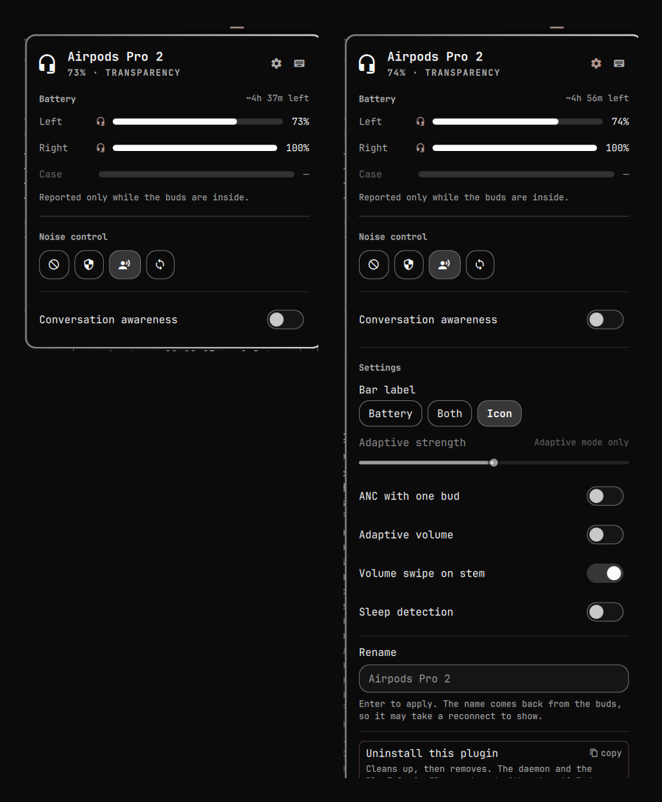

# AirPods for Omarchy

Battery, noise control and the settings Apple hides, in the Omarchy bar.



The bar slot shows the **active listening mode** rather than a headphones icon —
the widget only exists while AirPods are connected, so a slot saying "AirPods
are here" says nothing you cannot already see. Hovering gives per-bud charge,
mode and placement without opening anything.

## Built on other people's work

This plugin draws no Bluetooth frames of its own. It stands on two projects:

- **[LibrePods](https://github.com/librepods-org/librepods)** — the project that
  reverse-engineered Apple's AACP protocol and made AirPods legible on
  non-Apple platforms. Every Linux AirPods tool, this one included, exists
  downstream of that work. Its Linux client has been rewritten from Qt to Rust
  (the `linux/rust` branch, packaged as `librepods-rust-bin`), an `iced` desktop
  app with a tray icon that is now growing beyond Apple hardware. It is the
  natural choice if you want a GUI rather than a bar widget — this plugin does
  not drive it, because the Rust rewrite exposes no CLI or IPC for anything
  outside its own window to talk to.
- **[airpods-tui](https://github.com/annoyedmilk/airpods-tui)** by annoyedmilk —
  the daemon this plugin actually speaks to. It owns the L2CAP session, the
  protocol, ear detection and media handling.

What is left for this plugin is the shell front end. See
[ACKNOWLEDGEMENTS.md](ACKNOWLEDGEMENTS.md) for the rest, including where the
debt is knowledge rather than code.

## Install

```bash
omarchy plugin add https://github.com/SotoAugusto/omarchy-airpods --enable
omarchy restart shell
~/.config/omarchy/plugins/io.github.sotoaugusto.airpods/setup
```

If you skip `setup`, the plugin will tell you what is missing: the panel shows
a checklist of the three prerequisites, and clicking any unmet row copies the
exact command to your clipboard. It re-checks every 20 seconds, so it clears
itself as you go.

`setup` is the only step that needs your attention, and only the first time.
It installs the [`airpods-tui`](https://github.com/annoyedmilk/airpods-tui)
daemon if missing, adds `DeviceID = bluetooth:004C:0000:0000` to
`/etc/bluetooth/main.conf` so BlueZ identifies as Apple, restarts bluetooth,
and enables the daemon at login. It checks before every step and is safe to
re-run. One sudo prompt, only if the DeviceID is not already set.

**If setup changed the DeviceID, forget and re-pair your AirPods.** The control
channel only opens on a pairing made after BlueZ started identifying as Apple —
an existing pairing will not do. This is the single most common reason the
widget shows nothing.

Why a script rather than an install hook: Omarchy deliberately never executes
anything from a plugin. It clones files, validates the manifest and flips a bit
over IPC — no hooks, no sudo. That is a security property worth having, so what
is left over is a script you run on purpose.

Everything after that is automatic. The plugin starts the daemon if it finds it
stopped, and restarts it if BlueZ reports the AirPods connected while the daemon
disagrees for 30 seconds — both without privileges, because it is a user unit.

## Removal

```bash
~/.config/omarchy/plugins/io.github.sotoaugusto.airpods/teardown
omarchy plugin remove io.github.sotoaugusto.airpods
omarchy restart shell
```

Or open the panel's settings (the gear) and click **Uninstall this plugin**,
which copies that whole line — correctly ordered — to your clipboard. It stays
reachable even when nothing is connected, since that is when you are most
likely to want it.

Run `teardown` **first** — removing the plugin deletes the script with it,
which is why the copied command chains them rather than listing them. It clears
the plugin's own state, then offers to stop the daemon and points at the
package, rather than assuming: both are shared with any other AirPods tool you
might use.

`teardown` disables the plugin before it cleans anything, because the plugin
would otherwise undo the cleanup while it ran — it restarts the daemon on
purpose whenever it finds it stopped.

`omarchy plugin remove` needs no cleanup of its own: because the plugin is
git-installed it takes the `rm -rf` path rather than leaving a backup folder,
and disabling strips the widget's entry from `shell.json`. Note that this also
discards the widget's settings — disabling is not a way to hide it temporarily.

### Already removed it without teardown?

Nothing is broken — verified by doing it. The plugin unloads cleanly, no
process is left running, `shell.json` is tidied and no backup folder is left
(a git-installed plugin is removed outright). What survives is the daemon,
still running and still enabled at login, plus two small files:

```bash
systemctl --user disable --now airpods-tui          # if nothing else uses it
rm -f ~/.local/state/omarchy/airpods-capabilities.json
rm -f "${XDG_RUNTIME_DIR:-/run/user/$(id -u)}/omarchy-airpods.json"
yay -R airpods-tui-bin                              # also reverts the DeviceID
```

The runtime file clears itself at the next reboot; the cache is a few hundred
bytes of remembered device capabilities. Removing the package is what reverts
`/etc/bluetooth/main.conf`.

## What it does

- **Battery** per bud and case, with charging state and a low-battery warning
- **Time remaining**, projected from the measured drain rate
- **Noise control** — Off / Noise Cancellation / Transparency / Adaptive
- **Ear detection** shown per bud, so "one in ear" says which
- **Settings** the device reports: adaptive ANC strength, ANC with one bud,
  adaptive volume, volume swipe, sleep detection, conversation awareness
- **Rename**
- **AAC pinning** — re-selects the AAC card profile on connect

### Controls

| | |
|---|---|
| Click | Open the panel |
| Right-click | Noise Cancellation ⇄ Transparency |
| Middle-click | Cycle all modes |
| `1`–`4` | Select a mode directly |
| `c` | Cycle modes |
| `a` | Conversation awareness |
| `s` / `k` | Show settings / shortcuts |

Right-click flips that specific pair because it is what the AirPods' own
press-and-hold does, and because every other Omarchy bar widget uses right-click
for one action rather than a long cycle.

Optional Hyprland bindings:

```lua
o.bind("SUPER + ALT + A", "AirPods", "omarchy-shell shell toggle io.github.sotoaugusto.airpods")
o.bind("SUPER + ALT + N", "AirPods noise mode", "omarchy-shell io.github.sotoaugusto.airpods cycleMode")
o.bind("SUPER + ALT + Q", "AirPods quiet toggle", "omarchy-shell io.github.sotoaugusto.airpods toggleQuiet")
```

## How it works

```
airpods-tui daemon  ──unix socket──  bin/omarchy-airpods  ──state file──  Service.qml  ──  Panel.qml
```

`bin/omarchy-airpods` owns the socket because QML cannot comfortably frame a
length-prefixed binary protocol. It folds the daemon's event stream into a flat
JSON state file the shell watches, and accepts one-shot commands.

`Service.qml` is a `service` plugin, so the shell mounts it **once** regardless
of monitor count. A bar surface is built per monitor, so putting the socket in
the widget would mean one `watch` process per display and every command sent
twice. `Panel.qml` only renders.

```bash
tests/run          # no AirPods, daemon or BlueZ needed
```

## Protocol notes

Everything here was measured against AirPods Pro (`0x2024`). Written down
because none of it is documented and all of it is easy to get wrong.

**Identifiers serialize as integers, not names.** `ControlCommandIdentifiers`
derives serde's `Serialize_repr`, so a command is
`["<mac>", {"ControlCommand": [13, [2]]}]` — not `"ListeningMode"`. A name is
accepted by the JSON parser, rejected by the deserializer, and dropped with an
error you will not see.

**Listening mode echoes; config toggles do not.** Setting a mode comes back on
the event stream within a second. Setting conversation awareness is *applied*
but never echoed — the new value only appears after the daemon reconnects and
re-reads the config. Config toggles are therefore held optimistically in the UI;
without that a switch sits on its old value and reads as broken.

**Modes are refused unless a bud is in an ear.** In the case *and* merely out of
the ear both fail. The daemon accepts the write and the buds ignore it, so this
looks exactly like a bug.

**The config block does not survive a reconnect.** The device dumps ~15
identifiers shortly after the AACP session comes up; the daemon's retained
snapshot drops `ControlCommand` events, so a client connecting later sees none
of them. Support is a property of the device, not the session, so it is cached
per-MAC in `~/.local/state/omarchy/airpods-capabilities.json`. Without that the
panel hides controls that work.

**`AllowOffOption` is never reported, but Off works.** Gating the Off button on
a positive report hid a mode the device accepts. Absence is not refusal.

**The case only knows its charge through the buds.** With them out it reports
level 0 / status disconnected — lid open or shut. Rendering that as "0%" is a
lie; hiding the row makes it look broken. It shows as unavailable.

**The codec is not stable.** AirPods speak only SBC and AAC. A fresh connect
negotiated AAC and a later reconnect came back on SBC-XQ unprompted.
`pactl send-message … switch-codec` answers `No such entity`; the working lever
is `set-card-profile <card> a2dp-sink`. The bluez card can take ~12s to appear
after BlueZ reports the device connected, so the pin retries.

## Known limitations

- A config write the device *rejects* shows as applied until the next reconnect,
  because rejections are as silent as acceptances.
- Drain history is in memory, so the time estimate resets when the shell
  restarts and needs ~10 minutes of wear to reappear.
- `shortcuts` and `settings` use a direct IPC target, which on a multi-monitor
  setup reaches one arbitrary instance. Device actions are unaffected.
- Untested on AirPods Max — the "Headphones" battery row has never rendered.

## License

MIT — see [LICENSE](LICENSE).

No third-party code is vendored.

The Bluetooth work belongs to **[airpods-tui](https://github.com/annoyedmilk/airpods-tui)**
by annoyedmilk (GPL-3.0-or-later), which this plugin drives as a separate
process over a Unix socket, and upstream of that to
**[LibrePods](https://github.com/librepods-org/librepods)** (AGPL-3.0-or-later),
which worked out Apple's AACP protocol in the first place. Neither is vendored
or linked; both are why this is possible.
